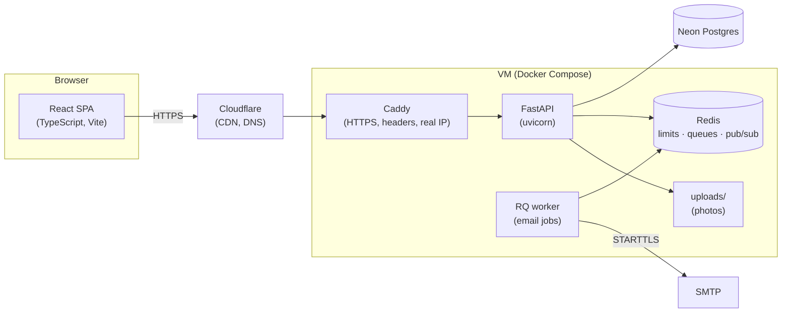

# BTU Market

**A marketplace where every account belongs to a verified student at one
university.** Buy and sell textbooks, notes, electronics and the rest of
what students turn over each semester, in Georgian and English, with prices
in GEL and handover in person.

**Live at [btumarket.ge](https://btumarket.ge)** - designed, built, deployed
and operated solo.

---

## The problem

Students already trade with each other, mostly in Facebook groups. Those
groups have no way to tell whether the person offering you a textbook is a
classmate or someone who joined yesterday from another city. That
uncertainty is the whole reason the trade stays small: nobody wants to
arrange a meeting with a stranger over a 40 GEL book.

The fix is a gate rather than a feature: registration requires a
`@btu.edu.ge` address, confirmed by an emailed code, or a Google sign-in
restricted to the same Workspace domain. Everyone inside is a verified
classmate, so the meeting stops being a risk and becomes a walk down a
corridor. Everything else in the product follows from that decision -
including what the product deliberately does *not* do: there are no
payments, no shipping and no escrow, because the exchange already happens
in a building both people are standing in.

## What it does

- **Listings** - up to 12 photos, ten categories, search with price filters
  and any combination of categories, six sort orders, mark sold and back,
  edit, delete, renew after a month.
- **Search across two alphabets** - a search for `macbook` finds a listing
  titled `მაკბუქი`, and the reverse. Georgian students type both ways and
  expect either to work.
- **Live chat** - WebSocket-pushed, scoped per listing, with unread counts,
  blocking, per-side conversation deletion, and an email nudge when a
  message would otherwise go unseen.
- **Saved searches** that email you when something matching appears.
- **Moderation** - new sellers' listings wait for approval until they have a
  track record, plus a report queue, bans and account removal.
- **Notifications, favourites, seller profiles, view counts.**
- **Bilingual throughout** - 349 strings in Georgian and English, including
  every error message.

## Engineering worth reading about

**Search that spans Georgian and Latin.** Transliteration can't solve this:
one Latin spelling maps to several plausible Georgian ones, and `c` is /k/
in *macbook* but ც in *macivari*. Instead both scripts fold onto a shared
phonetic skeleton stored per listing, ambiguous queries expand into a
bounded set of variants, and the two meet in the middle.
([`translit.py`](backend/translit.py))

**Photos are never trusted.** Every upload is decoded and re-encoded server
side, which proves it is an image at all, corrects phone-camera rotation,
strips EXIF metadata including GPS - so a photo of a textbook on a desk
can't leak a home address - and emits four files: full and thumbnail, WebP
and JPEG. ([`images.py`](backend/images.py))

**Chat delivery that survives more than one worker.** Each process tracks
only the sockets attached to itself and relays through a Redis pub/sub
channel, so a message reaches its recipient regardless of which worker
holds their connection. ([`ws_manager.py`](backend/ws_manager.py))

**Failure modes chosen per feature, not globally.** When Redis is down,
rate limiting and view counting fail open, because a cache outage should
not take the site down. The message-email cooldown fails closed, because
failing open there means unlimited notification emails for the length of
the outage.

**The database enforces its own relationships.** Every table linked to
another by application code alone until foreign keys were added, which meant
any delete path that missed a table left rows pointing at nothing - deleting
a listing did exactly that to its favourites. `ON UPDATE CASCADE` also turns
renaming an account into one update instead of rewriting twelve columns.
Two tables stay deliberately loose: a conversation outlives the listing it
was about, and a moderation report has to outlive both the listing and the
account it concerned.

**New sellers are reviewed until they have a track record.** A university
address gets you in, but listings wait in an approval queue until the seller
has three approved, after which they post immediately. It closes the gap
between "signed up" and "photo on the front page" without asking anyone to
be checked forever. ([`routers/admin.py`](backend/routers/admin.py))

**Duplicate submissions solved on the server.** Real devices produced
duplicate listings that no client-side guard caught. Each page load of the
post form carries a token, and repeat submissions return the listing
already created instead of a second one.

**Link previews for a single-page app.** Preview bots don't run JavaScript,
so `/listing/{id}` is served with Open Graph tags injected server side
while the app hydrates normally on top. ([`routers/pages.py`](backend/routers/pages.py))

**Keyboards in in-app browsers.** A browser only lifts a focused field above
the on-screen keyboard when the page has room left to scroll and the browser
admits the keyboard exists. Instagram's in-app browser reports neither, so
fields stayed hidden behind it. One handler now makes the room, and falls
back to placing the field itself when the viewport says nothing.
([`lib/keyboard.ts`](frontend/src/lib/keyboard.ts))

## Security

- bcrypt password hashing; JWTs in the `Authorization` header, never in a
  URL, and the WebSocket authenticates in its first message rather than a
  query string, so tokens stay out of logs.
- A password reset invalidates every session issued before it. Bans apply on
  the next request, not the next login.
- Redis-backed rate limits on login, registration, listing creation,
  messaging, contact reveals and password reset - keyed by account or by
  real client IP, resolved through the Cloudflare and Caddy chain so a
  forged header can't spoof it, and tuned not to punish a whole building
  behind one NAT.
- An enforced Content-Security-Policy with no inline scripts, plus HSTS and
  the standard header set, at the edge.
- Uploads validated by decoding them, never by extension or declared type.

## Architecture



| Layer | Choice |
|---|---|
| Frontend | React 19 + TypeScript + Vite, react-i18next |
| Backend | FastAPI + SQLAlchemy on uvicorn - 53 endpoints |
| Database | Postgres (Neon), 7 Alembic migrations, foreign keys enforced |
| Cache / queues | Redis: rate limits, dedupe, email queue, chat pub/sub |
| Images | Pillow |
| Packaging | Docker multi-stage (Node builds the SPA, Python runs it) |
| CI | GitHub Actions: API tests on ephemeral Postgres/Redis, Playwright browser tests, image build |
| Hosting | Oracle Cloud free tier, Ubuntu 24.04, Docker Compose |
| Edge | Cloudflare in front of Caddy |
| Monitoring | Sentry, UptimeRobot |

The backend serves the built SPA itself, so the whole app is one origin and
one deploy. Everything runs on free tiers, and each moving part had to earn
its place: Redis arrived when correctness across processes demanded it,
Postgres when durability did.

## Running it in production

Worth showing, because it is the part student projects usually skip.

- **Deploys** are one command. The dev machine commits, CI builds and
  publishes the image, the server pulls it - the server never builds and
  never holds a commit of its own. Migrations apply automatically on the way
  up, and a deploy only reports success after the health check passes.
- **Backups** run nightly: a `pg_dump` of the database and a tarball of the
  uploads, kept 14 days, with a copy pulled off the machine daily so the
  backups don't share a disk with the thing they protect.
- **Monitoring** is Sentry for exceptions and an external uptime check
  against a health endpoint that makes a real database round trip rather
  than reporting that the process is alive.
- **Logs** are capped per service so they can't fill a small disk.

## Tests

44 API tests cover registration and login, rate-limit lockouts, session
invalidation after a password change, listing permissions and the review
queue, the image pipeline, cross-script search, and chat.

Three browser tests cover what an API test structurally cannot: that the
forms still submit and the buttons are still wired. They drive the built
frontend against a real backend - the same single-origin arrangement as
production - through registering, posting a first listing, finding it as a
stranger, and one student messaging another. They paid for themselves on
their first run by turning up a registration bug: usernames are derived
from the email's local part, and the check for one already being taken
compared a lowercased column against a title-case candidate, so it never
matched - two students whose addresses derive the same name would collide
and the second would get a 500 instead of a numbered name.

CI runs the API tests against real Postgres and Redis containers and the
browser tests against a throwaway SQLite file, then builds the frontend and
the production image.

```bash
cd backend && pytest              # API
cd frontend && npm run test:e2e   # browser
```

## Known limitations

- Search is `ILIKE` plus the phonetic fold rather than a full-text index.
  Postgres has no Georgian dictionary, so full-text search would fall back
  to splitting on spaces and gain almost nothing over what is there, while
  complicating the cross-script matching. A `pg_trgm` index is the answer
  if query volume ever makes it matter.
- Phone numbers are format-checked, not SMS-verified - per-message pricing
  to Georgia made real verification not worth it, and chat is the primary
  contact channel.
- Timestamps are naive UTC end to end, normalised on display.
- The review queue only holds a seller's *first* listing. It is a filter
  against drive-by misuse, not a guarantee that everything on the site has
  been read.

## Status

Live and feature-complete, launching to students at the start of the autumn
semester to catch the textbook rush. The listings visible now are seeded
test data, so the site can be evaluated looking the way it will when it is
full.

## Local setup

Requires Python 3.12+ and Node 20+. With no `MARKETPLACE_DATABASE_URL` set
the backend falls back to SQLite, so a fresh clone runs with no
infrastructure and no accounts to create.

```bash
cd backend && pip install -r requirements.txt
MARKETPLACE_DEV=1 uvicorn main:app --reload --port 8001

cd frontend && npm install && npm run dev   # http://127.0.0.1:5173
```

Development mode prints verification codes to the console instead of
emailing them. See [`backend/config.py`](backend/config.py) for every
environment variable.
